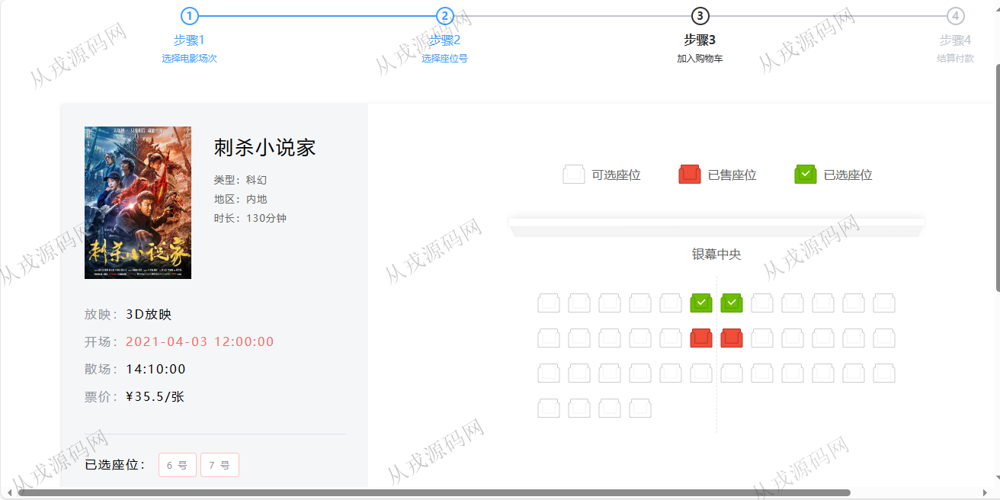
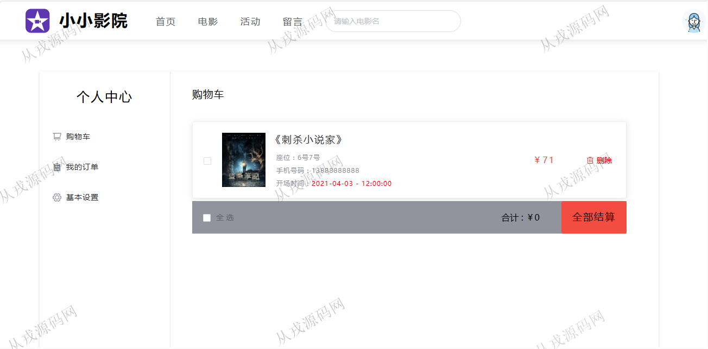
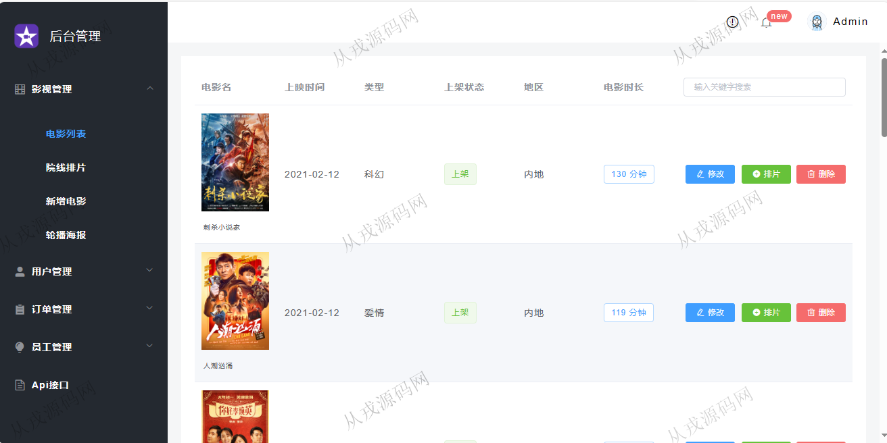
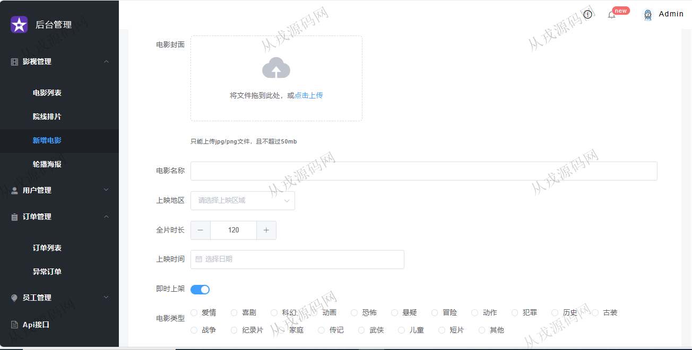
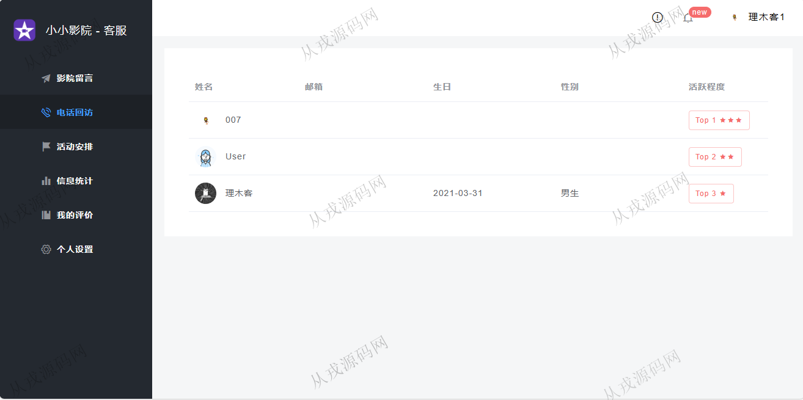

<h1 align="center">190.影院电影管理系统</h1>

- <b>完整代码获取地址：从戎源码网 ([https://armycodes.com/](https://armycodes.com/))</b>
- <b>技术探讨、资料分享，请加QQ群：692619798</b> 
- <b>作者微信：19941326836  QQ：952045282</b> 
- <b>承接计算机毕业设计、Java毕业设计、Python毕业设计、深度学习、机器学习</b>
- <b>选题+开题报告+任务书+程序定制+安装调试+论文+答辩ppt 一条龙服务</b>
- <b>所有选题地址 ([https://github.com/YuLin-Coder/AllProjectCatalog](https://github.com/YuLin-Coder/AllProjectCatalog)) </b>

## 项目介绍
基于ssm+vue2的影院电影管理系统：前端 vue、elementui，后端 maven、springboot、springmvc、spring、mybatis；角色分为管理员、用户、客服；集成电影在线选座、在线购票，在线提交订单等功能于一体的系统。

## 功能介绍

### 用户

- 基本功能：登录，退出，注册
- 网站首页：全局搜索，主导航栏，轮播图，正在热播，热门榜单Top10
- 电影票购买：电影列表展示，分类导航，电影详情，电影评分，在线选座，购物车，在线结算
- 活动：活动列表查询，活动详情，报名参加，已经结束的活动不可以参加
- 留言：给客服评价，留言

### 管理员

- 电影列表：电影列表查询，关键词搜索，新增，修改，删除，排片
- 院线排片：排片信息列表查询，关键词搜索，统计票房，修改，删除
- 轮播图海报管理：前台首页轮播图设置，图片上传，上架，下架，删除
- 用户管理：用户自行注册，管理员查看用户数据，可以给用户重置密码
- 订单管理：查询用户的订单数据，撤销订单，上报订单异常
- 员工管理：员工信息的增删改查，每日工作内容记录

### 客服

- 基本功能：登录，退出
- 影院留言：留言信息查看，留言回复
- 电话回访：电话回访的活跃度排行
- 活动安排：活动列表查询，添加影院活动
- 信息统计：订单信息数据统计
- 我的评价：我的评价信息列表查询
- 个人设置：个人信息查看与修改

## 环境

- <b>IntelliJ IDEA 2021.3</b>

- <b>Mysql 5.7.26</b>

- <b>Node 14.14.0</b>

- <b>JDK 1.8</b>

## 运行截图

